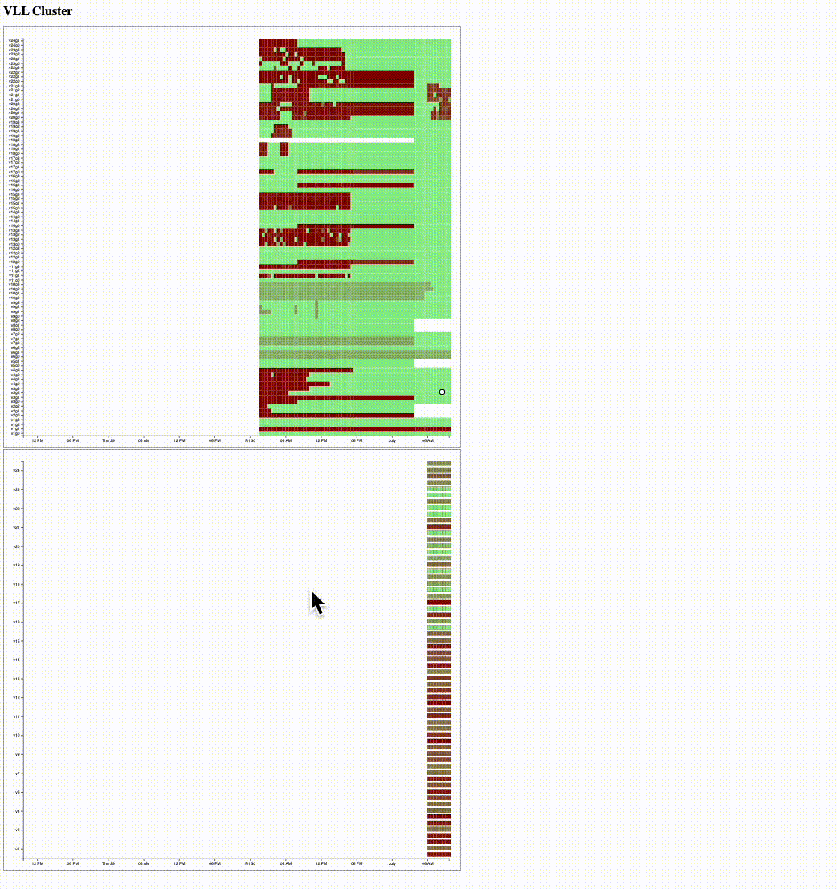

### VLL GPU Utilization History ###

From VISTEC's internal network, visit this [url](http://10.204.100.106/palakons/) to access the 3d.js chart.

The result should looks similar to below:

<!-- #add screengrab.gif -->

The chart updates every the 30 minutes.

Tag me for feature suggestions or for contributions/collaborations.